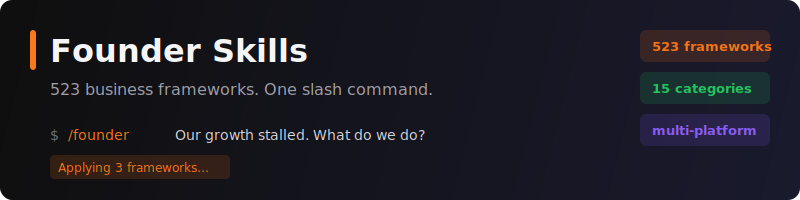
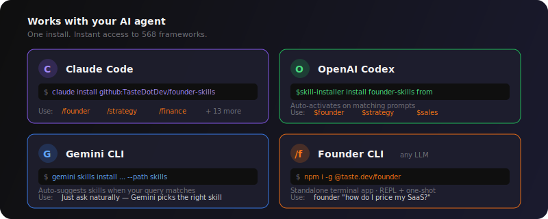
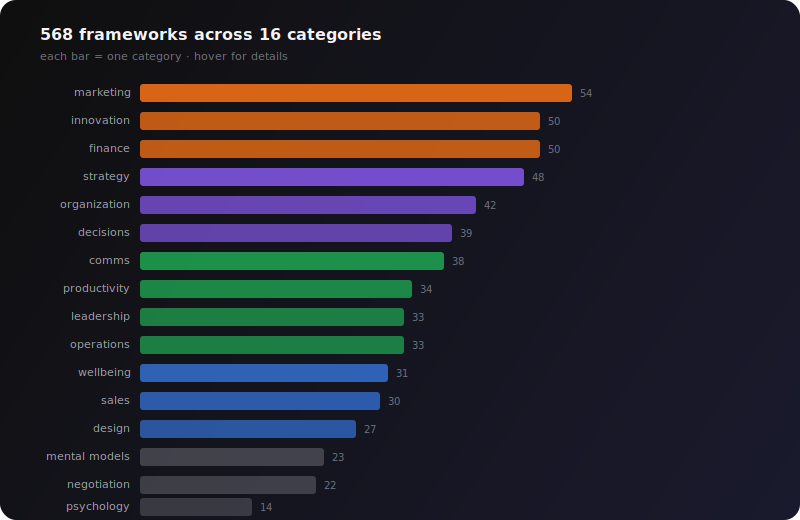
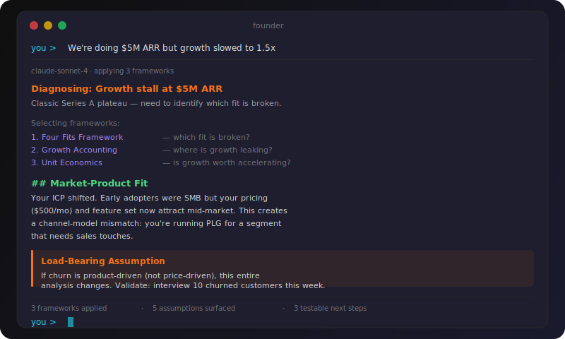

<p align="center">
  
</p>

<p align="center">
  <a href="#install">Install</a> &bull;
  <a href="#how-it-works">How It Works</a> &bull;
  <a href="#whats-inside">What's Inside</a> &bull;
  <a href="#contributing">Contribute</a> &bull;
  <a href="https://github.com/TasteDotDev/founder-cli">CLI</a>
</p>

---

You know that thing where you're staring at a business problem at 2am and thinking *"there's probably a framework for this"*?

There are **568** of them. And now they live inside your AI agent.

**Founder Skills** gives you instant access to the best thinking from **Porter, Christensen, Reid Hoffman, Brian Balfour, Teresa Torres, Paul Graham**, and dozens more — as AI-powered skills that actually *apply* the frameworks to your specific situation. Not generic advice. Not Wikipedia summaries. Real analysis, with assumptions called out and ways to validate before committing.

Works with **Claude Code**, **OpenAI Codex**, **Gemini CLI**, and any agent that speaks the open [Agent Skills](https://agentskills.io) standard.

## Install

<p align="center">
  
</p>

### Claude Code

```bash
claude install github:TasteDotDev/founder-skills
```

After install, use slash commands:

```
/founder We're doing $5M ARR but growth slowed to 1.5x
/strategy Apply Porter's Five Forces to our market
/marketing What growth loops work for a B2B SaaS at $2M ARR?
/finance Build a unit economics model for our freemium product
```

All 16 categories are available as `/commands`. Type `/` to see the full list.

### OpenAI Codex

Inside Codex, prompt the built-in skill installer:

```
$skill-installer install founder-skills from https://github.com/TasteDotDev/founder-skills
```

Or clone manually into your user skills directory:

```bash
git clone https://github.com/TasteDotDev/founder-skills
cp -r founder-skills/skills/* ~/.agents/skills/
```

After install, Codex auto-activates skills when your prompt matches. You can also invoke directly:

```
$founder Our churn spiked to 8% after the last pricing change
$strategy Should we go upmarket or double down on SMB?
$sales Design a cold outbound sequence for enterprise CTOs
```

### Gemini CLI

```bash
gemini skills install https://github.com/TasteDotDev/founder-skills --path skills
```

After install, skills activate automatically when your query matches. Just ask naturally:

```
How should I price my API product?
We need to cut burn rate — what frameworks help here?
Help me prepare for a Series A negotiation
```

Gemini picks the right skill(s) based on your question. Run `gemini skills list` to see all installed skills.

### Founder CLI (standalone, any LLM)

```bash
npm i -g @taste.dev/founder
```

After install, use directly from your terminal:

```bash
founder "how do I price my SaaS?"
founder                              # interactive REPL mode
founder list                         # browse all categories
founder list strategy                # see strategy frameworks
```

Works with Anthropic, OpenAI, Google, OpenRouter. See [founder-cli](https://github.com/TasteDotDev/founder-cli).

## How It Works

<p align="center">
  
</p>

1. **Ask** — Describe any business problem in plain language
2. **Diagnose** — Identifies what's actually going on (not what you think is going on)
3. **Apply** — Selects and applies the right frameworks from 568 options
4. **Validate** — Surfaces assumptions and proposes concrete ways to test them

Every answer ends with an assumptions table, a challenge section, and testable next steps. No hand-waving.

## What's Inside

<p align="center">
  
</p>

| Category | # | Highlights |
|----------|---|---------|
| **strategy** | 48 | Porter's Five Forces, Blitzscaling, Wardley Maps, Blue Ocean, Cold Start |
| **marketing** | 54 | Product-Led Growth, Growth Loops, Dark Social, Build in Public, Viral Content |
| **innovation** | 50 | Superhuman PMF Engine, Working Backwards, AI-First Product, RICE/ICE |
| **finance** | 50 | Unit Economics, SAFE Notes, Growth Accounting, AI Pricing, Sequoia Deck |
| **communication** | 38 | Pyramid Principle, SCQA, Crisis Comms, Elevator Pitch, Storytelling |
| **organization** | 42 | Async-First Culture, Team Topologies, McKinsey 7S, RACI, Kotter Change |
| **decision-making** | 39 | Cynefin, Pre-Mortem, Decision Matrix, OODA Loop, Six Thinking Hats |
| **productivity** | 34 | GTD, Deep Work, OKRs, Sprint Planning, Atomic Habits, Eisenhower |
| **leadership** | 33 | Founder Mode, Radical Candor, Servant Leadership, GROW Model |
| **sales** | 30 | MEDDIC, Challenger Sale, Land and Expand, PLG Sales, Cold Email |
| **operations** | 33 | Lean, Six Sigma, Theory of Constraints, Kaizen, Risk Register |
| **design** | 27 | Design Thinking, UX Research, Service Blueprint, Accessibility |
| **negotiation** | 22 | BATNA, Harvard Principled, Anchoring, ZOPA, Conflict Resolution |
| **mental-models** | 23 | First Principles, Inversion, Second-Order Thinking, Circle of Competence |
| **wellbeing** | 31 | Atomic Habits, Huberman, CBT, Stress, Burnout, Loneliness, Parenting, Anxiety |
| **psychology** | 14 | Nudge Theory, Cognitive Bias Audit, Flow State, Habit Formation |

Plus **`/founder`** — the meta-skill that diagnoses your problem and picks the right frameworks automatically.

## Example

<p align="center">
  
</p>

<details>
<summary>Text version</summary>

```
You:     /founder We're doing $5M ARR but growth slowed to 1.5x

Founder: Diagnosing: Growth stall at $5M ARR — classic Series A plateau

         Selecting frameworks:
           1. Four Fits Framework  — which fit is broken?
           2. Growth Accounting    — where is growth leaking?
           3. Unit Economics       — is growth worth accelerating?

         Applying Four Fits Framework...

         ## Market-Product Fit
         Your ICP shifted. Early adopters were SMB but your
         pricing ($500/mo) and feature set now attract mid-market.
         This creates a channel-model mismatch: you're
         running PLG for a segment that needs sales touches.

         ## Load-Bearing Assumption
         If churn is product-driven (not price-driven),
         this entire analysis changes.
         Validate: Interview 10 churned customers this week.
```

</details>

## Contributing

Every framework is just a markdown file. Adding one takes 5 minutes.

### Add a framework

1. Fork this repo
2. Pick a category (e.g., `skills/strategy/`)
3. Add your framework to `frameworks.md` following the existing pattern:

````markdown
---

## Your Framework Name
**Slug**: `your-framework-slug`

**Description**: One-line description of what it does.

**Expert instructions**:
```
You are an expert in [domain]. When applying this framework...
[Detailed instructions for the AI]
```

**When to use**: [Situations where this framework shines]
**Limitations**: [When NOT to use it]
````

4. Update the framework count in `SKILL.md`
5. Open a PR

### Ideas for new frameworks

Missing your favorite framework? [Open an issue](https://github.com/TasteDotDev/founder-skills/issues/new) or just submit a PR. We especially want:

- **Industry-specific** frameworks (healthcare, fintech, marketplace, developer tools)
- **Regional** frameworks (EU market entry, APAC growth, LATAM expansion)
- **Emerging** frameworks (AI-native GTM, LLM-first product design, agent-native growth)
- **Your own** frameworks — if you've built a repeatable playbook, share it

### Add a new category

1. Create `skills/your-category/SKILL.md` and `frameworks.md`
2. Add a command alias in `skills/commands/your-category.md`
3. Open a PR

## Structure

Every skill follows the open [Agent Skills](https://agentskills.io) standard — plain markdown with YAML frontmatter:

```
skills/
  strategy/
    SKILL.md           # Skill definition + YAML frontmatter
    frameworks.md      # All framework definitions
  marketing/
    SKILL.md
    frameworks.md
  ...
  founder/
    SKILL.md           # Meta-skill: diagnoses and routes
  commands/
    founder.md         # /founder slash command
    strategy.md        # /strategy slash command
    ...
.agents/
  skills -> ../skills  # Codex & Gemini auto-discovery
```

No build step. No compilation. Just markdown that any AI agent can read.

## License

MIT © [taste.dev](https://taste.dev)
