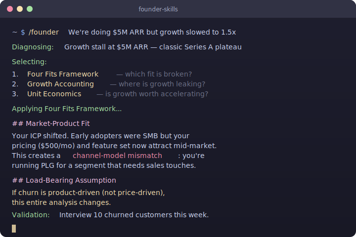
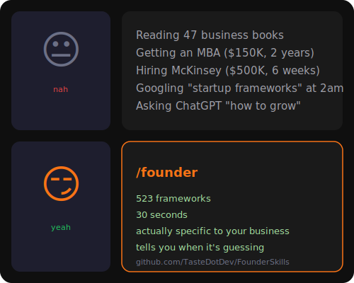
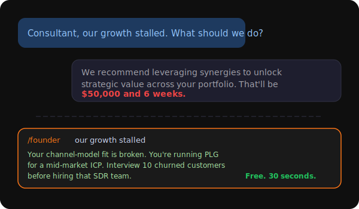
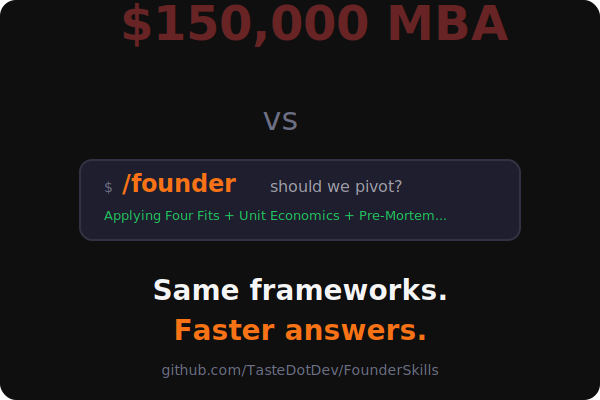

<p align="center">
  
</p>
<p align="center">
  <a href="#quick-start">Quick Start</a> &bull;
  <a href="#the-founder-command">The /founder Command</a> &bull;
  <a href="#all-commands">All Commands</a> &bull;
  <a href="#multi-platform">Multi-Platform</a>
</p>

---

You know that thing where you're staring at a business problem at 2am and thinking *"there's probably a framework for this"*?

There are 523 of them. And now they live in your terminal.

**Founder Skills** gives you instant access to the best thinking from **Porter, Christensen, Reid Hoffman, Brian Balfour, Teresa Torres, Paul Graham**, and dozens more — as AI-powered slash commands that actually apply the frameworks to *your* specific situation. Not generic advice. Not Wikipedia summaries. Real analysis, with assumptions called out and recommendations you can test.

Works with **Claude Code**, **OpenAI**, **Gemini**, and any LLM.

> *"Like having McKinsey, YC, and a16z in your terminal, except they give you straight answers and don't charge $500/hr."*

---

## Quick Start

### Claude Code

**One command. That's it.**

```
/plugins marketplace TasteDotDev/FounderSkills
```

Install the `founder-skills` plugin when prompted. Done. You now have 16 slash commands and 523 frameworks.

Check what's installed anytime:

```
/plugins
```

<details>
<summary><strong>Prefer git clone?</strong></summary>

```bash
# Global install (all projects)
git clone https://github.com/TasteDotDev/FounderSkills ~/.claude/skills/founder-skills

# Project-only install
git clone https://github.com/TasteDotDev/FounderSkills .claude/skills/founder-skills
```

</details>

**Now try it:**

```
/founder We're a 50-person B2B SaaS doing $5M ARR, growth slowed from 3x to 1.5x
```

That's it. `/founder` figures out you need Four Fits + Growth Accounting + Unit Economics, applies all three to your situation, and gives you a prioritized action plan with validation steps. No framework selection needed.

---

## The `/founder` Command

`/founder` is the one command to rule them all. Describe any business problem in plain English and it will:

1. **Diagnose** what you're actually dealing with (not what you think you're dealing with)
2. **Select** the 2-4 best frameworks from 523 options
3. **Apply** each one with full rigor — every section, every dimension, no shortcuts
4. **Challenge** its own analysis (devil's advocate, assumption stress-test, pre-mortem)
5. **Synthesize** into a prioritized action plan with specific validation gates

```
/founder Should we pivot from B2C to B2B?
/founder I need to pitch investors for our Series A
/founder Our team is growing from 10 to 50, how should we restructure?
/founder Competitor just raised $100M and is undercutting our prices
/founder How will AI agents disrupt our industry in the next 3 years?
```

**The secret sauce:** Every analysis ends with an assumptions table and a "here's how to test this before committing" section. Because the honest answer to most strategy questions is *"it depends, and here's how to find out."*

<p align="center">
  
</p>

---

## All Commands

`/founder` handles everything. Go direct to a category only when you know exactly what you need.

| Command | # | Frameworks |
|:--------|:-:|:-----------|
| **`/founder`** | **523** | **The brain. Picks the right frameworks for you.** |
| `/founder-strategy` | 48 | Porter, Blitzscaling, Wardley Maps, Cold Start, AI GTM |
| `/founder-marketing` | 54 | PLG, Build in Public, TikTok Growth, Dark Social |
| `/founder-innovation` | 50 | Superhuman PMF, Amazon PR/FAQ, RICE/ICE |
| `/founder-finance` | 46 | Sequoia Deck, SAFE Notes, Growth Accounting |
| `/founder-organization` | 40 | Async-First, Team Topologies, Kotter Change |
| `/founder-decision-making` | 39 | Decision Matrix, Cynefin, Pre-Mortem, OODA |
| `/founder-communication` | 38 | Pyramid Principle, SCQA, Elevator Pitch |
| `/founder-productivity` | 34 | GTD, Deep Work, OKRs, Atomic Habits |
| `/founder-leadership` | 33 | Founder Mode, Radical Candor, GROW Model |
| `/founder-sales` | 30 | Cold Email, MEDDIC, Land & Expand |
| `/founder-design` | 27 | Design Thinking, UX Research, Service Blueprint |
| `/founder-operations` | 25 | Lean, Six Sigma, Theory of Constraints |
| `/founder-mental-models` | 23 | First Principles, Inversion, Second-Order Thinking |
| `/founder-negotiation` | 22 | BATNA, Harvard Method, Anchoring |
| `/founder-psychology` | 14 | Nudge Theory, Cognitive Bias Audit, Flow State |

---

## What Makes This Different

**It's not a chatbot that read a business book once.** Every framework has:

- A **structured expert prompt** — the AI adopts the mindset of a specialist in that exact domain
- **Required inputs** — it asks you the right questions, not generic ones
- **Full output structure** — every section, every dimension, no hand-waving
- **Assumptions audit** — every analysis surfaces what it assumed and how to validate it
- **Contrarian check** — the AI argues against its own recommendation to stress-test it

The result reads like something you'd get from a top-tier strategy consultant, except it's honest about what it doesn't know.

---

## Highlights

<table>
<tr><td width="50%">

### Growth & Strategy
- **Blitzscaling** (Reid Hoffman)
- **Four Fits Framework** (Brian Balfour / Reforge)
- **Cold Start Problem** (Andrew Chen / a16z)
- **North Star Metric** (Sean Ellis)
- **PLG Flywheel** (Wes Bush / OpenView)
- **Marketplace Liquidity**

</td><td width="50%">

### Fundraising & Finance
- **Sequoia Pitch Deck** (the gold standard)
- **YC Seed Deck Framework**
- **SAFE Notes** (caps, discounts, pro rata)
- **Growth Accounting** (Tribe Capital)
- **Unit Economics** deep dive
- **AI Product Pricing**

</td></tr>
<tr><td>

### Modern Distribution
- **Build in Public** (Pieter Levels, Buffer)
- **Short-Form Video Growth** (TikTok/Reels)
- **Cold Email Framework** (Alex Berman)
- **Community-Led Growth**
- **Dark Social Strategy**
- **Creator-Led Growth**

</td><td>

### AI Era
- **AI-First Product Design**
- **AI Agent Design Framework**
- **AI Go-To-Market Strategy**
- **AI Product Pricing**
- **AI Future Scenario Planning**

</td></tr>
</table>

Plus classics: **Porter's Five Forces**, **Jobs To Be Done**, **Design Thinking**, **OKRs**, **SWOT** (but only when it's actually the right tool), and 470+ more.

---

## Multi-Platform

Founder Skills works everywhere, not just Claude Code.

### OpenAI (GPTs & Assistants)

```bash
git clone https://github.com/TasteDotDev/FounderSkills && cd FounderSkills
python3 build.py
```

| Platform | Instructions | Framework details |
|:---------|:------------|:-----------------|
| **GPTs** | `dist/openai/gpts/<category>/instructions.md` | Upload `knowledge/frameworks.md` as knowledge file |
| **Assistants** | `dist/openai/assistants/<category>.json` | Upload `files/<category>-frameworks.md` to vector store |

### Gemini (Gems & API)

| Platform | Instructions | Framework details |
|:---------|:------------|:-----------------|
| **Gems** | `dist/gemini/gems/<category>/instructions.md` | Upload `knowledge/frameworks.md` as knowledge file |
| **API** | `dist/gemini/api/<category>.md` (all-in-one) | Included inline |

### Standalone

Individual self-contained prompts at `dist/standalone/<category>/<framework>.md` — copy-paste into any LLM.

### Build it yourself

```bash
python3 build.py          # Build all platforms (640 files)
python3 build.py --clean  # Clean rebuild
```

<details>
<summary>Output structure</summary>

```
dist/
  openai/
    gpts/<category>/instructions.md + knowledge/frameworks.md
    assistants/<category>.json + files/<category>-frameworks.md
  gemini/
    gems/<category>/instructions.md + knowledge/frameworks.md
    api/<category>.md
  standalone/<category>/<framework-slug>.md
  manifest.json
```

</details>

---

## Under the Hood

Each skill has two files:

```
skills/strategy/
├── SKILL.md          # System prompt + framework catalog
└── frameworks.md     # Detailed expert prompts for each framework
```

**SKILL.md** is what runs when you invoke a slash command. **frameworks.md** is the deep reference the AI reads when applying a specific framework — expert persona, required inputs, output structure, origin attribution.

---

## Standing on the Shoulders of Giants

These frameworks come from decades of the best business thinking:

| Domain | Thinkers |
|:-------|:---------|
| **Strategy** | Michael Porter, Clayton Christensen, Reid Hoffman, Andrew Chen |
| **Growth** | Brian Balfour (Reforge), Sean Ellis, Wes Bush, Elena Verna |
| **VC / Startup** | Y Combinator, Sequoia, a16z, First Round, OpenView |
| **Product** | Teresa Torres, Rahul Vohra, Marty Cagan, Jeff Bezos |
| **Leadership** | Paul Graham, Kim Scott, Patrick Lencioni, Brian Chesky |
| **AI** | Anthropic, OpenAI, a16z AI team, Kyle Poyar |
| **Psychology** | Daniel Kahneman, Richard Thaler, Robert Cialdini |
| **Communication** | Barbara Minto, Chip & Dan Heath, Jonah Berger |

We built the prompts. They built the ideas. Credit where it's due.

---

## Meanwhile...

<p align="center">
  
</p>

<details>
<summary>More memes</summary>

<p align="center">
  
</p>
<p align="center">
  
</p>

</details>

---

## Contributing

Want to add a framework? PRs welcome.

1. Add a JSON definition to `server/tools/definitions/<category>/<slug>.json`
2. Run the skill regeneration script
3. Submit a PR

---

<p align="center">
  <strong>MIT License</strong> &bull; Copyright (c) <a href="https://taste.dev">taste.dev</a>
</p>
<p align="center">
  <em>Now stop reading READMEs and go build something.</em>
</p>
